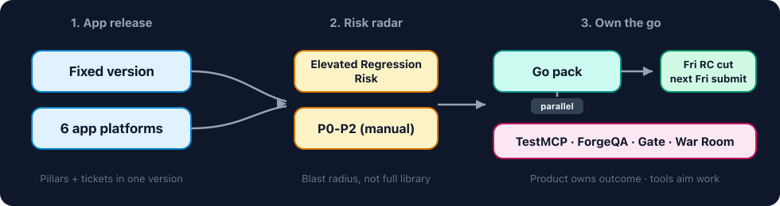
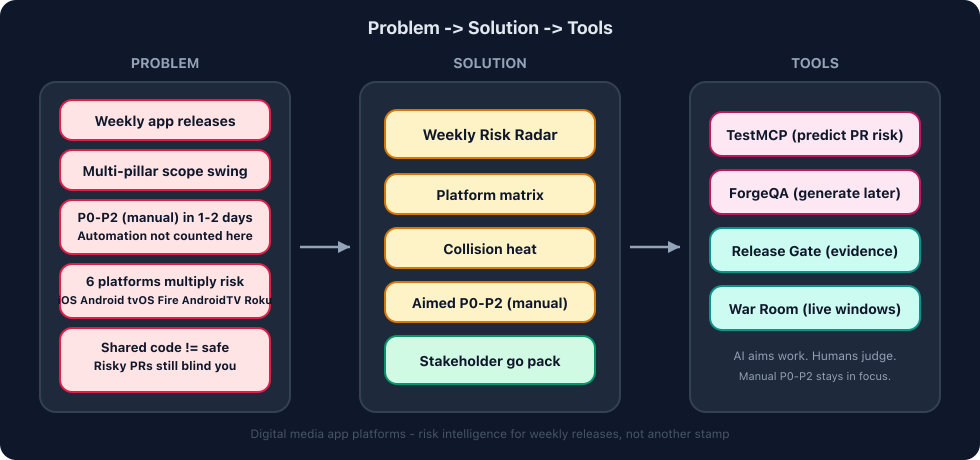

# 📡 Weekly Risk Radar

**The conductor for digital media weekly app releases.** One fixed version pulls tickets from many pillars across **six app platforms**. This board shows collision heat, an aimed **P0–P2 (manual)** slice, and a stakeholder go pack — so product can own the ship decision with eyes open.

Demo board for a fictional National News Apps release (`v2026.32`). Example data used here — real solution plan shape. No live Jira, production data, or real network branding.

## How the flow works



| Step | Color | What it is |
|------|-------|------------|
| **1. App release** | Blue | Fixed version + six app platforms (iOS, Android, tvOS, Fire TV, Android TV, Roku) |
| **2. Risk radar** | Amber | Elevated Regression Risk + aimed **P0–P2 (manual)** slice (automation not counted here) |
| **3. Own the go** | Teal / pink | Stakeholder go pack · Fri RC cut · following Fri store submission · partner tools in parallel |

## The story (problem -> solution -> tools)



| Lane | What it is |
|------|------------|
| **Problem** | Weekly app releases, multi-pillar scope swing, **P0–P2 (manual) in ~1–2 days**, six platforms multiply risk, shared code still leaves you blind to risky PRs. **Automation coverage is not counted here.** QA may no longer hold sign-off, but residual risk remains. |
| **Solution** | Weekly Risk Radar — release-level blast radius across platforms, not a full-library rinse |
| **Tools** | TestMCP, ForgeQA, Release Gate Lab, Live Event War Room aim and evidence the work the radar prioritizes |

Radar does **not** replace those tools. It sits above them and answers: *what must a human verify on which platforms for this week’s app release?*

### What “app platforms” means here

| Platform | Notes |
|----------|--------|
| **iOS** | Shares codebase with tvOS |
| **tvOS** | Same code family as iOS — still device-specific risk |
| **Android** | Phone / tablet |
| **Fire TV** | Shares codebase with Android TV |
| **Android TV** | Same code family as Fire TV — still device-specific risk |
| **Roku** | Separate stack — easy to under-test in a crunch |

Shared code helps shipping. It does **not** mean one happy path clears the release.

### Pillars in this release (demo names)

Portfolio-safe labels. Ownership stays clear; org-specific pod names are not used.

| Pillar | Owns (demo) |
|--------|-------------|
| **Growth** | Push opt-in, re-engagement prompts |
| **Engagement** | CMS editorial, homepage, live / Watch Live |
| **Core** | My Account, auth, shared app shell |
| **Platform** | Player SDK, analytics updates, CTV leanback |

## Why this exists

Digital media orgs want a weekly app cadence without enterprise-scale scaffolding. Full **P0–P2 (manual)** coverage cannot keep up when:

- Many pods tag into one fixed version
- Scope swings with agile commitments
- Checks multiply across iOS, Android, tvOS, Fire TV, Android TV, and Roku
- Shared codebases create a false sense of safety on risky PRs
- **Automation coverage is not the story on this board** — humans still need an aimed manual plan
- Product / stakeholders own the go (QA publishes evidence, not a rubber stamp)

Weekly Risk Radar turns that chaos into a **shared risk picture**.

## What’s on the board

1. **Release dial** — Elevated Regression Risk until the stakeholder pack is complete  
2. **App platforms** — the six-device matrix + share notes  
3. **Pillars in this release** — who contributed scope  
4. **Collision heat** — surfaces touched by 2+ pillars (including platform blind spots)  
5. **Aimed P0–P2 (manual) slice** — human checks with partner-tool hints  
6. **Stakeholder pack** — checklist ending in residual-risk accept  
7. **Toolkit map** — links to the four partner repos  

**Cadence in the demo:** Friday cut RC build · following Friday store submission (no mid-week freeze — devs can work up to RC cut).

## Partner toolkit

| Tool | Role in the loop |
|------|------------------|
| [TestMCP](https://github.com/ramonacraft/testmcp) | Predict what to verify from a hot / risky PR |
| [ForgeQA](https://github.com/ramonacraft/forgeqa) | Generate reviewable Playwright when automation comes later |
| [Release Gate Lab](https://github.com/ramonacraft/release-gate-lab) | Lean smoke + go/no-go evidence board |
| [Live Event War Room](https://github.com/ramonacraft/live-event-war-room) | Playback health + living runbook for live windows |

```text
Jira fixed version (weekly app release)
  -> Weekly Risk Radar (this repo)
  -> TestMCP / ForgeQA (aim verification)
  -> Release Gate Lab (ship evidence)
  -> War Room (live / high-stakes windows)
  -> Product / DRI accepts residual risk
```

## Quick start

**Prerequisites:** Node.js 20+

```bash
npm install
npm run dev
```

Open the URL Vite prints (usually `http://localhost:5173`).

You should see the `v2026.32` demo release, six platforms, collision heat, P0–P2 (manual) slice, and stakeholder pack. Toggle the checklist to flip Elevated Regression Risk → Residual risk accepted.

```bash
npm run build
```

## Stack

| Layer | Choice |
|-------|--------|
| App | Vite + React + TypeScript |
| Demo data | `src/data/demoTrain.ts` |
| Diagrams | `docs/flow.svg` + `docs/ecosystem.svg` (PNG embeds for GitHub) |
| Host (optional) | Vercel (`vercel.json` included) |

## Project layout

```
weekly-risk-radar/
├── docs/
│   ├── flow.svg / flow.png
│   └── ecosystem.svg / ecosystem.png
├── src/
│   ├── data/demoTrain.ts
│   ├── types/train.ts
│   └── App.tsx
└── README.md
```

## Notes / Privacy

- **Published by** [Ramona Bonitatis](https://github.com/ramonacraft)
- **Default: no secrets.** Demo data only; `.env.example` has no real tokens
- No employer, customer, or production Jira data in this repo
- Fictional national news apps weekly release for portfolio storytelling and learning
- This problem frame is about **P0–P2 (manual)** verification — automation coverage is not counted here
